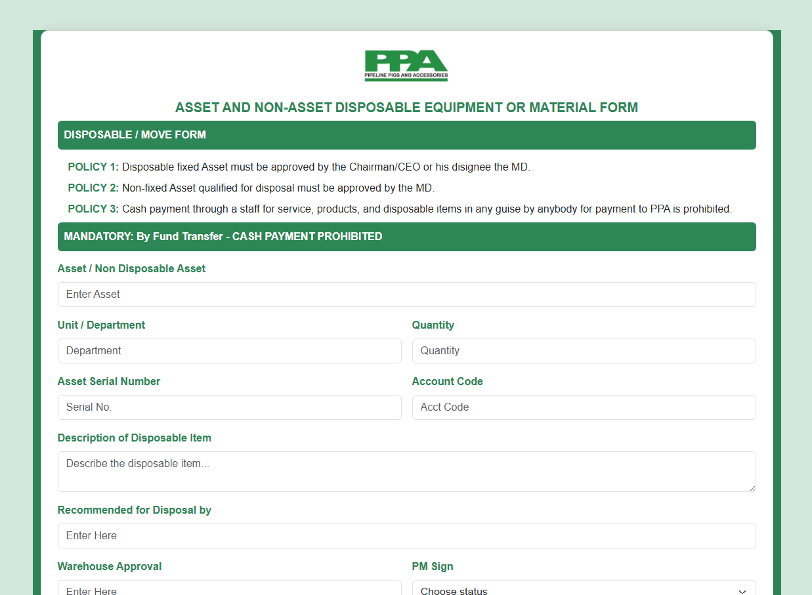
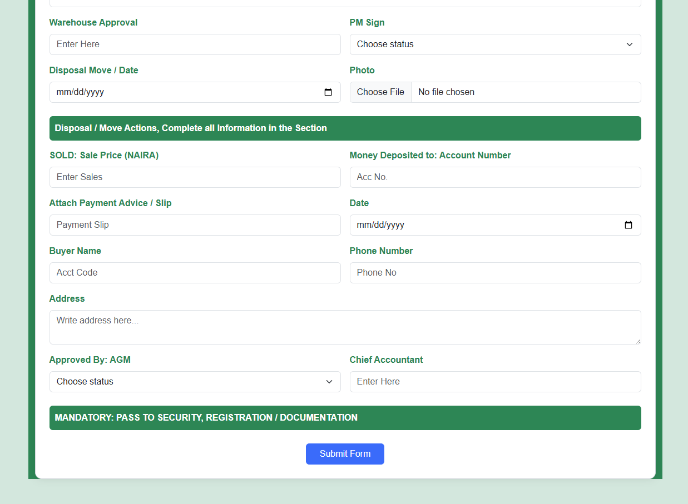

# Pipeline Pigs and Accessories Limited

**Asset & Non-Asset Disposal Form 🗂️**

This project presents a **fully responsive and policy-compliant disposal form** created for **Pipeline Pigs and Accessories Limited**, a Pipeline Flow Assurance Company. It streamlines the documentation and approval process for both **fixed and non-fixed asset disposal or movement**, ensuring accountability and compliance with internal policies.

---

## 🔍 Form Overview

### 📋 Key Features

- **Policy-Based Approval Workflow**  
  Enforces three core disposal policies including MD/CEO sign-off and prohibits unauthorized cash payments.

- **Asset & Department Tracking**  
  Captures detailed data for assets, serials, units, and quantities being recommended for disposal.

- **Disposal Action Logging**  
  Includes sale price, payment method, buyer info, and required security documentation.

- **Approval Flow**  
  Provides status-select fields for Warehouse, PM, AGM, and Chief Accountant authorization.

- **Photo & Evidence Upload**  
  Allows image file uploads for disposed items and payment slips.

- **Responsive Design**  
  Mobile-first layout optimized with Bootstrap 5 for use on any device.

- **Clean UI & Branding**  
  Designed to align with Pipeline Pigs and Accessories Limited’s professional standards and internal documentation aesthetics.

---

## 📸 Visual Previews

### Form Header  

### Disposal Entry Section  

---

## 🛠️ Technologies Used

- **HTML5** – For semantic and structured layout  
- **CSS3 / Custom Styling** – For clean and accessible design  
- **Bootstrap 5.3** – For responsive UI and reusable form components

---

## 🚀 How to Use

1. **Enter Asset Details** – Fill in asset name, quantity, and serials.
2. **Follow Disposal Policies** – Comply with signatory rules and select approval statuses.
3. **Record Sales Info** – Input payment details, attach receipts, and buyer information.
4. **Upload Evidence** – Upload item photo and payment advice.
5. **Submit** – Save, print, or submit the form.

---

## 🧠 Skills You'll Learn

- Designing **business-compliant forms**  
- Managing **multi-level approvals**  
- Structuring **responsive and printable layouts**  
- Implementing **form file uploads**  
- Applying **company branding in digital assets**

---

## 🔖 Tags

#AssetDisposal #ComplianceForms #Bootstrap5 #ResponsiveDesign #HTML5 #PipelineCompany #Pigs

---

**Built to support transparent disposal, approval, and documentation workflows at Pipeline Pigs and Accessories Limited.** 🔐💼
